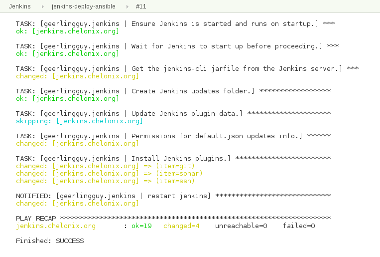

# Jenkins Ansible Plugin

This plugin allows to execute [Ansible](http://www.ansible.com/) tasks as a job build step.

## Global Configuration

Ansible needs to be on the PATH for the build job in order to be used.
This can be done through either Jenkins Global Tool Configuration or
including Ansible on the OS User PATH variable.

### Global Tool Configuration

Configuring Ansible through the Global Tool Configuration in Jenkins
(Jenkins → Manage Jenkins → Global Tool Configuration) allows for
multiple Ansible installations to be present and used by different
Jenkins jobs.

1.  Click "Add Ansible"
2.  Configure the name and path

    | Field name                            | Description                                                                                               |
    | --------------------------------------- | ----------------------------------------------------------------------------------------------------------- |
    | Name                                  | Symbolic name used to identify a specific Ansible installation when multiple installations are configured |
    | Path to ansible executables directory | Directory containing the *ansible,* *ansible-playbook*, and *ansible-vault* binaries                      |

3.  Repeat for any additional desired installations

### OS User PATH

Ansible can also be added to the PATH user used by the Jenkins executor
instead of configured through Global Tool Configuration. This is done
through normal OS tools outside of Jenkins and is not covered by this
guide.

------------------------------------------------------------------------

## Adhoc

[Adhoc commands](http://docs.ansible.com/ansible/latest/intro_adhoc.html) allow
for simple operations to be done without writing a full playbook. This
allows for a convenient way of doing quick tasks with Ansible.

### Examples

#### Scripted

**Jenkinsfile**

``` groovy
ansibleAdhoc credentialsId: 'private_key', inventory: 'inventories/a/hosts', hosts: 'hosts_pattern', moduleArguments: 'module_arguments'
```

#### Declarative

**Jenkinsfile**

``` groovy
ansibleAdhoc(credentialsId: 'private_key', inventory: 'inventories/a/hosts', hosts: 'hosts_pattern', moduleArguments: 'module_arguments')
```

### Arguments

See also [jenkins.io](https://jenkins.io/doc/pipeline/steps/ansible/) documentation.

| Freestyle Name                         | Pipeline Name      |  Description                                                  |
| -------------------------------------- | ------------------ | ------------------------------------------------------------- |
| Ansible installation                   | installation       | Ansible installation to use for the playbook invocation       |
| Host pattern                           | hosts              | The host pattern to manage. See Ansible Patterns for details. |
| Module                                 | module             | CLI arg: `-m`                                                 |
| Module arguments or command to execute | moduleArguments    | CLI arg: `-a`                                                 |
| Inventory file or host list            | inventory          | CLI arg: `-i`: See the Inventory section for additional details. |
| Inventory inline content               | inventoryContent   | CLI arg: `-i`: See the Inventory section for additional details. |
| Credentials                            | credentialsId      | The Jenkins credential to use for the SSH connection. See the Authentication section for additional details. |
| Vault Credentials                      | vaultCredentialsId | CLI arg: `--vault-password-file`: The Jenkins credential to use as the vault credential. See the Vault Credentials section for additional details. |
| sudo                                   | become             | CLI arg: `-s` |
| sudo user                              | becomeUser         | CLI arg: `-U` |
| Number of parallel processes           | forks              | CLI arg: `-f` |
| Check host SSH key                     | hostKeyChecking    | Toggle checking of the host key. Sets the environment variable `ANSIBLE_HOST_KEY_CHECKING`, similar to the recommendations for running with Vagrant. |
| Unbuffered stdout                      |                    | Toggle buffering of standard out. Sets the environment variable `PYTHONUNBUFFERED`, similar to the recommendations for running with Vagrant. |
| Colorized stdout                       | colorized          | Toggle color codes in console text. See Colorized Output section for example usage. Sets the environment variable `ANSIBLE_FORCE_COLOR`, similar to the recommendations for running with Vagrant. |
| Extra Variables                        | extraVars          | CLI arg: `-e` |
| Additional parameters                  | extras             | String passed to the Ansible Command Line invocation as-is. |

## Playbook

[Ansible playbook](http://docs.ansible.com/ansible/latest/playbooks.html)
operations can be run with the plugin. The plugin provides several
conveniences such as easily using credentials from the Jenkins
credential store, unbuffered color output in the log, etc.

### Examples

#### Scripted

**Jenkinsfile**

``` groovy
ansiblePlaybook credentialsId: 'private_key', inventory: 'inventories/a/hosts', playbook: 'my_playbook.yml'
```

#### Declarative

**Jenkinsfile**

``` groovy
ansiblePlaybook(credentialsId: 'private_key', inventory: 'inventories/a/hosts', playbook: 'my_playbook.yml')
```

Additional scripted and declarative pipeline examples can be found on
the plugin's [GitHub
readme](https://github.com/jenkinsci/ansible-plugin).

### Arguments

Refer to [jenkins.io](https://jenkins.io/doc/pipeline/steps/ansible/)
for documentation extracted from the online help of the plugin.

| Freestyle Name                         | Pipeline Name       | Description                                                   |
| -------------------------------------- | ------------------- | ------------------------------------------------------------- |
| Ansible installation                   | installation        | Ansible installation to use for the playbook invocation       |
| Playbook path                          | playbook            | Mandatory. The name of the playbook to run                    |
| Inventory file or host list            | inventory           | CLI arg: `-i`: See the inventory section for details.         |
| Inventory inline content               | inventoryContent    | CLI arg: `-i`: See the inventory section for details.         |
| Credentials                            | credentialsId       | The Jenkins credential to use for the SSH connection. See the Authentication section for additional details |
| Vault Credentials                      | vaultCredentialsId  | The Jenkins credential to use as the vault credential. See the Vault Credentials section for more details |
| sudo                                   | sudo                | CLI arg: `-s`                                                 |
| sudo user                              | sudoUser            | CLI arg: `-U`                                                 |
| Host subset                            | limit               | CLI arg: `-l`                                                 |
| Tags to run                            | tags                | CLI arg: `-t`                                                 |
| Tags to skip                           | skippedTags         | CLI arg: `--skip-tags`                                        |
| Task to start at                       | startAtTask         | CLI arg: `--start-at-task`                                    |
| Number of parallel processes           | forks               | CLI arg: `-f`                                                 |
| Check host SSH key                     | hostKeyChecking     | Toggle checking of the host key. Sets the environment variable ANSIBLE_HOST_KEY_CHECKING, similar to the recommendations for running with Vagrant. |
| Colorized stdout                       | colorized           | Toggle color codes in console text. See Colorized Output section for example usage. Sets the environment variable ANSIBLE_FORCE_COLOR, similar to the recommendations for running with Vagrant.  |
| Additional parameters                  | extras              | String passed to the Ansible Command Line invocation as-is    |
| Extra Variables                        | extraVars           | CLI arg: `-e`                                                 |

Refer to the ansible-playbook manual page for details on how each
command line argument is interpreted.

### Authentication

#### SSH Keys

[SSH keys](https://help.ubuntu.com/community/SSH/OpenSSH/Keys) are the
recommended authentication method for SSH connections. The plugin
supports the credential type "SSH Username with private key" configured
in the Jenkins credential store through the [SSH crendentials
plugin](https://plugins.jenkins.io/ssh-credentials).

#### Password

Even if using SSH keys is recommended authentication method, password
authentication may sometimes be required. The plugin has supported
password based authentication since 0.3.0. When using password based
authentication, the [sshpass](http://sourceforge.net/projects/sshpass/)
binary is expected to be on the PATH. The plugin supports the credential
type "Username with password" configured in the Jenkins credential store
through the [SSH crendentials
plugin](https://plugins.jenkins.io/ssh-credentials).

### Vault Credentials

Vault credentials can be setup in the Jenkins credential store as either
a "Secret text" or a "Secret file".

### Colorized Output

The [AnsiColor plugin](https://plugins.jenkins.io/ansicolor) is needed
for colorized console output. Once installed, colorized output can be
enabled with the argument "colorized: true".

**Jenkinsfile**

``` groovy
ansiColor('xterm') {
    ansiblePlaybook(
        playbook: 'path/to/playbook.yml',
        inventory: 'path/to/inventory.ini',
        credentialsId: 'sample-ssh-key',
        colorized: true)
}
```



### Extra Parameters

Extra parameters is a string passed to the Ansible Command Line
invocation as-is and can be useful for arguments occasionally added to
an invocation at runtime, such as tags and host limits.

### Inventory

#### File

A string path to the inventory file to use with the playbook invocation.

#### Inline

The provided content is used as the content of the inventory file for
the playbook invocation.

### Using Jenkins Environment Variables

Jenkins environment variables can be accessed from within an Ansible
playbook. The Jenkins variables are injected as environment variables
making them available through the Ansible [lookup
plugin](http://docs.ansible.com/ansible/latest/playbooks_lookups.html).

The following Ansible playbook accesses the Jenkins BUILD\_TAG variable:

**playbook.yml**

``` groovy
---
- hosts: example
  tasks:
    - debug: msg="{{ lookup('env','BUILD_TAG') }}"
```

------------------------------------------------------------------------

## Vault

Most [Ansible Vault](https://docs.ansible.com/ansible/latest/vault.html)
operations can be performed with the plugin. Interactive operations such
as create, edit, and view are not supported through the plugin. One use
case for this enabling developers to encrypt secret values while keeping
the vault password a secret.

### Examples

#### Scripted

**Encrypts a File**

``` groovy
ansibleVault action: 'encrypt', input: 'vars/secrets.yml', vaultCredentialsId: 'ansible_vault_credentials'
```

**Encrypts a String**

``` groovy
ansibleVault action: 'encrypt_string', content: 'secret_content', vaultCredentialsId: 'ansible_vault_credentials'
```

#### Declarative

**Jenkinsfile**

``` groovy
ansibleVault(action: 'encrypt', input: 'vars/secrets.yml', vaultCredentialsId: 'ansible_vault_credentials')
```

**Jenkinsfile**

``` groovy
ansibleVault(action: 'encrypt_string', content: 'secret_content', vaultCredentialsId: 'ansible_vault_password')
```

### Arguments

See also [jenkins.io Pipeline step](https://jenkins.io/doc/pipeline/steps/ansible/) documentation.

| Freestyle Name                         | Pipeline Name         | Description                                                   |
| -------------------------------------- | --------------------- | ------------------------------------------------------------- |
| Ansible installation                   | installation          | Ansible installation to use for the playbook invocation       |
| Action                                 | action                | Mandatory. The name of the action to use. Interactive operations such as create, edit, and view are not supported. |
| Vault Credentials                      | vaultCredentialsId    | CLI arg: `--vault-password-file`. The Jenkins credential to use as the vault credential. See the Vault Credentials section for more details |
| New Vault Credentials                  | newVaultCredentialsId | CLI arg: `--new-vault-password-file`. The Jenkins credential to use as the vault credential. See the Vault Credentials section for more details |
| Content                                | content               | The content to encrypt with the 'encrypt_string' action.      |
| Input                                  | input                 | The file to encrypt with the encrypt actions.                 |
| Output                                 | output                | CLI arg: `--output`                                           |

### Vault Credentials

Vault credentials can be setup in the Jenkins credential store as either
a "Secret text" or a "Secret file".

------------------------------------------------------------------------

## Open Issues

[View issues in Jira](https://issues.jenkins.io/secure/IssueNavigator.jspa?reset=true&jqlQuery=component%20=%20ansible-plugin%20AND%20status%20in%20%28Open,%20%22In%20Progress%22,%20Reopened%29&tempMax=1000&src=confmacro)

------------------------------------------------------------------------

## Changelog

#### Version 1.0 (26 March 2018)

*  [Fix security issue](https://jenkins.io/security/advisory/2018-03-26/#SECURITY-630):
            Do not disable host key verification by default. **This may
            break existing configurations as host key verification will
            be enabled everywhere by default.**

#### Version 0.8.0 (16 Jan 2018)

*  Add support for Ansible Vault
            [JENKINS-48499](https://issues.jenkins.io/browse/JENKINS-48499)
*   Add hostKeyChecking option to pipeline [JENKINS-42445](https://issues.jenkins.io/browse/JENKINS-42445)

#### Version 0.6.2 (3 Jan 2017)

*  Fix blocker bug when launched from a pipeline
            [JENKINS-40780](https://issues.jenkins.io/browse/JENKINS-40780)

#### Version 0.6.1 (1 Jan 2017)

*  Use latest parent project definition in order to deploy
            plugin (thanks
            to [alecharp](https://github.com/alecharp) for the help and
            the PR)

#### Version 0.6 (31 Dec 2016)

**WARN: 0.6.x version will be the last one to support Jenkins 1.xxx and
Ansible 1.x - The 0.7.x and next releases will require Jenkins 2.32.1
(or higher) and Ansible 2.2 (or higher)**

*  Add a "do not specify" option for
            inventory [JENKINS-34627](https://issues.jenkins.io/browse/JENKINS-34627)
* Support inventoryContent in pipeline (thanks
            to [leewin12](https://github.com/leewin12) for the PR)
* Add support of extra variables in jobdsl (thanks
            to [pawbur](https://github.com/pawbur) for the PR)
* Support empty forks (number of parallel processes)
            parameter [JENKINS-39438](https://issues.jenkins.io/browse/JENKINS-39438)
* Escape '%' character in private key path (thanks
            to [ewollesen](https://github.com/ewollesen) for the PR)
* Omit ansible option when expanded environment variable is
            empty (thanks to [vjestin](https://github.com/vjestin) for
            the PR)
* Add the --forks parameter configurable in pipeline step
            (thanks to
            [anguswilliams](https://github.com/anguswilliams) for the
            PR)
* Fix usage of environment variable in ansiblePlaybook
            pipeline step (thanks to
            [thomasKalmar](https://github.com/thomasKalmar)
            and [barthorre](https://github.com/barthorre) for the
            PR) [JENKINS-38289](https://issues.jenkins.io/browse/JENKINS-38289)

#### Version 0.5 (5 May 2016)

*  Add support for ansible extra variables
            [JENKINS-29863](https://issues.jenkins.io/browse/JENKINS-29863)
* Improve Pipeline plugin
            integration [JENKINS-32911](https://issues.jenkins.io/browse/JENKINS-32911)
* Add the possibility to use the default inventory file
            (thanks to Johann Schmitz for the PR)
* Add colorized output in pipeline jobs (thanks to
            Kirill Merkushev for the PR)
* Make Jenkins build variables available as environment
            variables for ansible (thanks to Kevin Mooney for the
            PR) [JENKINS-29284](https://issues.jenkins.io/browse/JENKINS-29284)

#### Version 0.4 (25 December 2015)

*  Support for password protected SSH
            keys [JENKINS-30656](https://issues.jenkins.io/browse/JENKINS-30656)
* Initial support for the workflow
            plugin [JENKINS-30398](https://issues.jenkins.io/browse/JENKINS-30398)
* Add support for Job DSL plugin (thanks to Kirill Merkushev
            for the
            PR) [JENKINS-31790](https://issues.jenkins.io/browse/JENKINS-31790)

#### Version 0.3.1 (15 July 2015)

*  Fix execution on slave
            nodes [JENKINS-29294](https://issues.jenkins.io/browse/JENKINS-29294)

#### Version 0.3 (20 June 2015)

*  Add support for password based SSH authentication (with
            sshpass)
* Environment variables can be used in Module and Module
            arguments text field in Ad-hoc command builder
* Environment variables can be used in inline inventory text
            box
            [JENKINS-28547](https://issues.jenkins.io/browse/JENKINS-28547)

#### Version 0.2 (11 May 2015)

*  Fix NullPointerException when no credentials are selected
* Fix --skippedTags parameter configuration which was ignored
* Fix NullPointerException and print an error message in the
            build console when the inventory is not set in the job
            configuration

#### Version 0.1 (01 May 2015)

*  Initial version

This plugin gives the possibility to run [Ansible](http://www.ansible.com/) ad-hoc command or playbooks as a build step.

[](https://ci.jenkins.io/job/Plugins/job/ansible-plugin/job/master/)

## Using Jenkins Build and Environment Variables

It is possible to access build and environment variables in ansible playbooks. These variables are injected as environment variables within the ansible process. For example, use this code in an ansible playbook to access Jenkins ```BUILD_TAG``` variable.

```yaml
---
- hosts: example
  tasks:
    - debug: msg="{{ lookup('env','BUILD_TAG') }}"
```

## Job DSL support

```groovy
steps {
    ansiblePlaybook(String playbook) {
        inventoryPath(String path)
        inventoryContent(String content, boolean dynamic = false)
        ansibleName(String name)
        limit(String limit)
        tags(String tags)
        skippedTags(String tags)
        startAtTask(String task)
        credentialsId(String id)
        become(boolean become = true)
        becomeUser(String user = 'root')
        sudo(boolean sudo = true)
        sudoUser(String user = 'root')
        forks(int forks = 5)
        unbufferedOutput(boolean unbufferedOutput = true)
        colorizedOutput(boolean colorizedOutput = false)
        hostKeyChecking(boolean hostKeyChecking = false)
        additionalParameters(String params)
        extraVars {
            extraVar(String key, String value, boolean hidden)
        }
    }

    ansibleAdHoc(String module, String command) {
        ansibleName(String name)
        inventoryPath(String path)
        inventoryContent(String content, boolean dynamic = false)
        credentialsId(String id)
        hostPattern(String pattern)
        become(boolean become = true)
        becomeUser(String user = 'root')
        sudo(boolean sudo = true)
        sudoUser(String user = 'root')
        forks(int forks = 5)
        unbufferedOutput(boolean unbufferedOutput = true)
        colorizedOutput(boolean colorizedOutput = false)
        hostKeyChecking(boolean hostKeyChecking = false)
        additionalParameters(String params)
        extraVars {
            extraVar(String key, String value, boolean hidden)
        }
    }
}
```

### Example

```groovy
steps {
    ansiblePlaybook('path/playbook.yml') {
        inventoryPath('hosts.ini')
        ansibleName('1.9.4')
        tags('one,two')
        credentialsId('credsid')
        become(true)
        becomeUser("user")
        extraVars {
            extraVar("key1", "value1", false)
            extraVar("key2", "value2", true)
        }
    }
}
```

## Pipeline support

Ansible playbooks can be executed from workflow scripts. Only the `playbook` parameter is mandatory.

### Example

```groovy
node {
    ansiblePlaybook(
        playbook: 'path/to/playbook.yml',
        inventory: 'path/to/inventory.ini',
        credentialsId: 'sample-ssh-key',
        extras: '-e parameter="some value"')
}
```

### Extra Variables

Extra variables can be passed to ansible by using a map in the pipeline script.
Supported value types are: `String`, `Boolean`, `Number`.
By default the value will be considered potentially sensitive and masked in the logs.
To override this give a map with keys `value` and `hidden`.

```groovy
node {
    ansiblePlaybook(
        inventory: 'local_inventory/hosts.cfg',
        playbook: 'cloud_playbooks/create-aws.yml',
        extraVars: [
            login: 'mylogin',
            toggle: true,
            forks: 8,
            not_secret: [value: 'I want to see this in the logs', hidden: false]
        ])
}
```

### Colorized Console Log

You need to install the [AnsiColor plugin](https://plugins.jenkins.io/ansicolor/) to output a
colorized Ansible log.

```groovy
node {
    wrap([$class: 'AnsiColorBuildWrapper', colorMapName: "xterm"]) {
        ansiblePlaybook(
            playbook: 'path/to/playbook.yml',
            inventory: 'path/to/inventory.ini',
            credentialsId: 'sample-ssh-key',
            colorized: true)
    }
}
```
